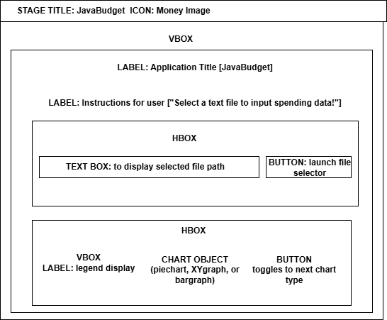
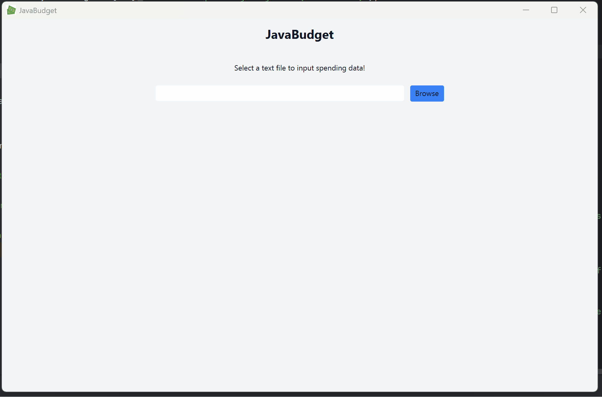
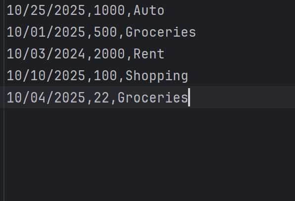
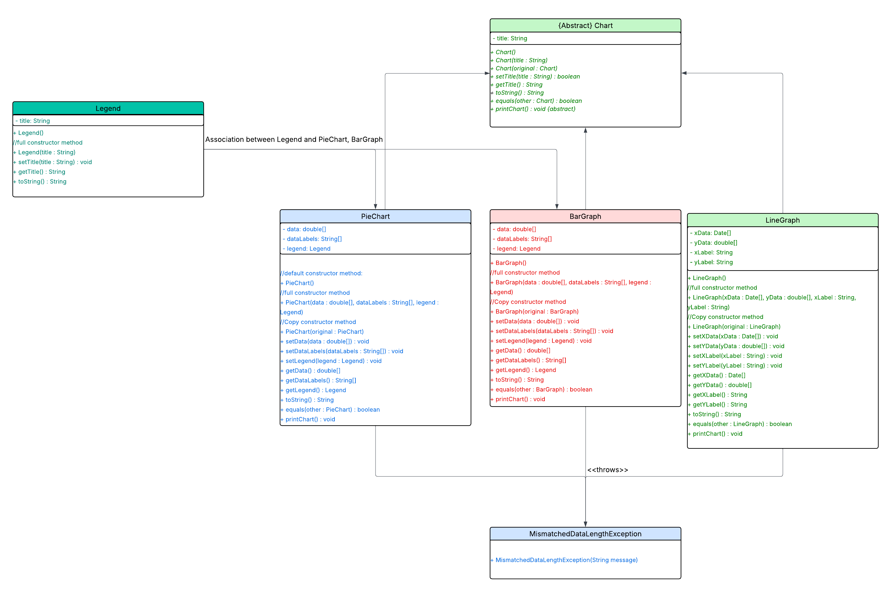

# Unit Deliverable 3 - Final Project Portfolio
  
## Project Description
This project is a budgeting app. The application uses Javafx to allow the user to upload files with their financial information. The driver then parses that data and displays the user's finances to the GUI. The user's spending is grouped into categories for users to track their spending habits. The 3 graph types are parsed into 3 distinct classes: PieChart, BarGraph, and LineGraph. Each class is derived from the abstract parent class Chart. The user can click the ">>" button to toggle which chart type they want to display their financial data.
 

## Group Members
 
Isabella Watson
 

## Project Name
 
JavaBudget
 

## Project Requirements
 

<b>Wireframe Design:</b> png image included in GitHub repo resources folder: src/main/resources/images and Readme
 

<b> Java GUI in IntelliJ:</b> .gif of GUI function included in README and repo: 
 

<b>Program Function:</b> Integrated the abstract class "Chart" and derived classes "PieChart", "LineGraph", and "BarGraph" to manage budget data uploaded by the user. The GUI allows the user to upload a .txt file of their spending and the program parses the data into category, amount spent, and date. The program then feeds the category array and amount spent array into a PieChart, Linegraph, and barGraph objects to manipulate the data. The formatted data is then fed into JavaFx graph objects: Piechart, Barchart, and XYGraph to display back to the user.
  
<b>Included:</b> 4 concrete classes (PieChart, LineGraph, BarGraph, Legend), 3 tester clases (PieChartTester, LineGraphTester, BarGraphTester), 1 abstract class (Graph), inheritance/polymorphism, custom exception class (MismatchedDataLengthException)
  
<b>Not Included:</b> an inner class was not included here because it does not make sense. None of the chart types are logically ties to each other. They are all child classes of the abstract class Graph.java. They exist independently and dont depend on the state of other classes.

## Wireframe
 

 

## GUI Gif
  

  
## Data Input Example
  

  
## UML
  

  